# Software Development Life Cycle

## Introduction

This flowchart provides a visual representation of the key stages involved in the software development life cycle. Each step is accompanied by detailed documentation to guide you through best practices and standardized processes.

## Flowchart

```mermaid
---
title: Software Development Cycle
---
flowchart TB
  A([1. Open the JIRA story <a href='https://markeyser.github.io/cookiecutter-collabora/how-to-guides/jira-story-best-practices/?h=jira'>link</a>]) ==> B([2. Create a branch from main 🪝 <a href='https://markeyser.github.io/cookiecutter-collabora/how-to-guides/git-branch-naming-standards/'>link</a>])
  B ==> C([3. Develop Python code])
  C ==> D([4. Debug Python code])
  D ==> E([5. Unit test with PyTest 🪝 <a href='https://markeyser.github.io/cookiecutter-collabora/how-to-guides/pytest-inroduction-guide/'>link</a>])
  E ==> F([6. Type check with Mypy <a href='https://markeyser.github.io/cookiecutter-collabora/how-to-guides/type-checking-mypy/?h=type+che'>link</a>])
  F ==> G([7. Refactor code])
  G ==> H([8. Format code with Black 🪝 <a href='https://markeyser.github.io/cookiecutter-collabora/tutorials/black-formatter/?h=black'>link</a>])
  H ==> I([9. Lint code with Ruff 🪝 <a href='https://markeyser.github.io/cookiecutter-collabora/tutorials/ruff-linter/?h=lint'>link</a>])
  I ==> J([10. Pass pre-commit hooks 🪝 <a href='https://markeyser.github.io/cookiecutter-collabora/how-to-guides/pre-commit-hooks-guide/'>link</a>])
  J ==> K([11. Update documentation <a href='https://markeyser.github.io/cookiecutter-collabora/tutorials/mkdocs-docs/?h=mkd'>link</a>])
  K ==> L([12. Commit changes 🪝 <a href='https://markeyser.github.io/cookiecutter-collabora/how-to-guides/commit-message-standards-ml/?h=commit'>link</a>])
  L ==> M([13. Push to remote repo])
  M --> |Repeat as necessary for multiple commits|C
  M ==> N([14. Open a Pull Request <a href='https://markeyser.github.io/cookiecutter-collabora/how-to-guides/templates/?h=pull'>link</a>])
  N ==> O([15. Code Review <a href='https://markeyser.github.io/cookiecutter-collabora/how-to-guides/code-review-best-practices/?h=review'>link</a>])
  O ==> P([16. Address review feedback])
  P ==> Q([17. Merge into main])
  Q ==> R([18. Continuous Integration/Deployment])
  R ==> S([19. Integration Testing])
  S ==> T([20. Deploy to Staging])
  T ==> U([21. Monitoring and Logging])
  U ==> |Start again with a new issue|A

  classDef highlighted fill:#d9534f,stroke:#333,stroke-width:2px,color:#fff;
  classDef blue fill:#5bc0de,stroke:#333,stroke-width:2px,color:#fff;
  class A,B,C,F,H,I,J,L,M,N highlighted;
  class R,S,T,U blue;
```

```mermaid
---
title: Software Development Cycle
---
flowchart TB
  A("<div style='text-align: left;'><b>1. Initiation and Planning:</b> <br>• Scope and Requirements <br>• <a href='https://markeyser.github.io/cookiecutter-collabora/how-to-guides/jira-story-best-practices/?h=jira' style='text-decoration: underline; color: #ff00ff;'>Open Jira Story</a> <br>• <a href='https://markeyser.github.io/cookiecutter-collabora/how-to-guides/git-branch-naming-standards/'>Create a branch</a></div>")
  B("<div style='text-align: left;'><b>2. Development:</b> <br>• Develop Python Code<br>• <a href='https://markeyser.github.io/cookiecutter-collabora/how-to-guides/jira-story-best-practices/?h=jira' style='text-decoration: underline; color: #ff00ff;'>Error handling and logging</a> <br>• <a href='https://markeyser.github.io/cookiecutter-collabora/how-to-guides/git-branch-naming-standards/'>Inline comments and docstrings</a></div>")
  A ==> B
  C("<div style='text-align: left;'><b>3. Refactoring:</b> <br>• Type hints<br>• <a href='https://markeyser.github.io/cookiecutter-collabora/how-to-guides/cofig-files/' style='text-decoration: underline; color: #ff00ff;'>Config files</a> <br>• <a href='https://markeyser.github.io/cookiecutter-collabora/how-to-guides/cofig-files/'>Document</a></div>")
  B ==> C
  D("<div style='text-align: left;'><b>4. Quality:</b> <br>• <a href='https://markeyser.github.io/cookiecutter-collabora/how-to-guides/jira-story-best-practices/?h=jira' style='text-decoration: underline; color: #ff00ff;'>Run formatter</a><br>• <a href='https://markeyser.github.io/cookiecutter-collabora/how-to-guides/jira-story-best-practices/?h=jira' style='text-decoration: underline; color: #ff00ff;'>Run linter</a> <br>• <a href='https://markeyser.github.io/cookiecutter-collabora/how-to-guides/git-branch-naming-standards/'>Run Static typing checker</a><br>• <a href='https://markeyser.github.io/cookiecutter-collabora/how-to-guides/git-branch-naming-standards/'>Perform unit tests</a><br>• <a href='https://markeyser.github.io/cookiecutter-collabora/how-to-guides/git-branch-naming-standards/'>Conduct integration testing</a><br>• <a href='https://markeyser.github.io/cookiecutter-collabora/how-to-guides/git-branch-naming-standards/'>Optimize performance</a></div>")
  C ==> D
  E("<div style='text-align: left;'><b>4. Comprehensive Testing and Review:</b> <br>• <a href='https://markeyser.github.io/cookiecutter-collabora/how-to-guides/jira-story-best-practices/?h=jira' style='text-decoration: underline; color: #ff00ff;'>Perform end-to-end testing</a><br>• <a href='https://markeyser.github.io/cookiecutter-collabora/how-to-guides/jira-story-best-practices/?h=jira' style='text-decoration: underline; color: #ff00ff;'>Conduct code coverage analysis</a> <br>• <a href='https://markeyser.github.io/cookiecutter-collabora/how-to-guides/git-branch-naming-standards/'>Perform additional unit tests</a><br>• <a href='https://markeyser.github.io/cookiecutter-collabora/how-to-guides/git-branch-naming-standards/'>Perform unit tests</a></div>")
  D ==> E
  F("<div style='text-align: left;'><b>5. Quality Assurance and Compliance:</b> <br>• <a href='https://markeyser.github.io/cookiecutter-collabora/how-to-guides/jira-story-best-practices/?h=jira' style='text-decoration: underline; color: #ff00ff;'>Pass pre-commit hooks</a><br>• <a href='https://markeyser.github.io/cookiecutter-collabora/how-to-guides/jira-story-best-practices/?h=jira' style='text-decoration: underline; color: #ff00ff;'>Update documentation</a> <br>• <a href='https://markeyser.github.io/cookiecutter-collabora/how-to-guides/git-branch-naming-standards/'>Perform additional unit tests</a><br>• <a href='https://markeyser.github.io/cookiecutter-collabora/how-to-guides/git-branch-naming-standards/'>Perform unit tests</a><br>• <a href='https://markeyser.github.io/cookiecutter-collabora/how-to-guides/git-branch-naming-standards/'>Prepare deployment procedures and update CI/CD pipelines</a></div>")
  E ==> F
  classDef highlighted fill:#d9534f,stroke:#333,stroke-width:2px,color:#fff;
  classDef blue fill:#5bc0de,stroke:#333,stroke-width:2px,color:#fff;
  class H,I,J,L,M,N highlighted;
  class R,S,T,U blue;
```

