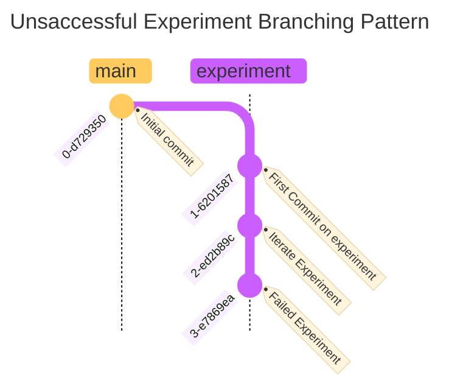
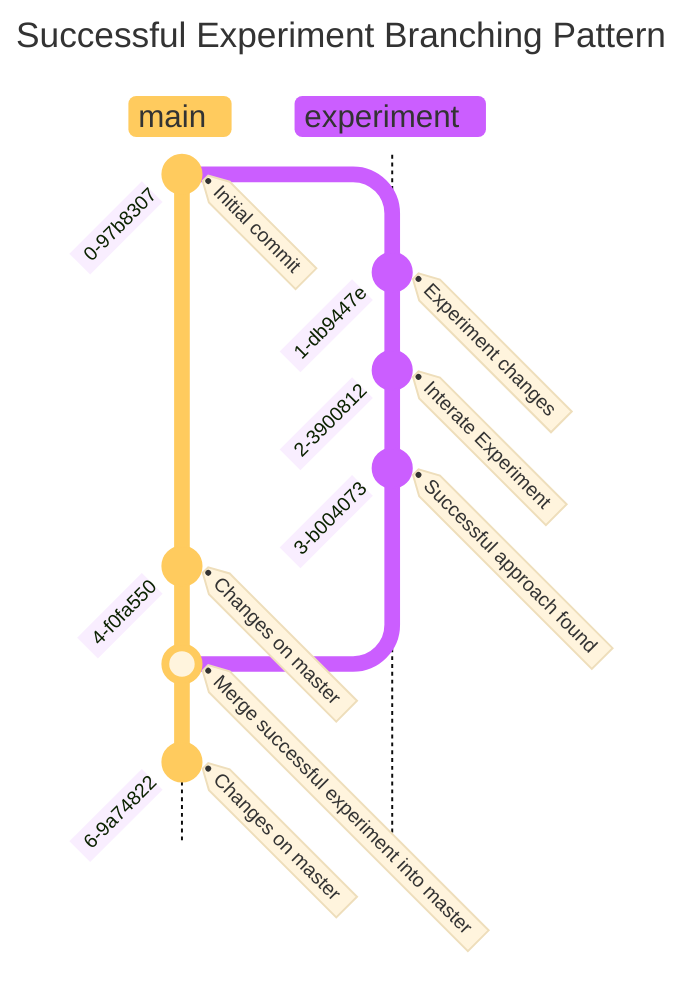

# Branching Strategies

!!! warning "Streamlining Version Control with Git Branching"

    In software engineering, maintaining a clean and organized codebase is
    paramount. A key principle to achieve this is the effective use of Git
    branches. Git branching eliminates the need for multiple versions of the
    same document with suffixes like "_v01", "_v02", etc. Instead, we create
    separate branches for different experiments or features, allowing us to
    work in isolation without impacting the main codebase.

    For instance, if you are working on a new feature, you can create a
    branch specifically for that work. This ensures that our primary script,
    such as `main_script.py`, remains the only version in the main branch.
    When a new feature or experiment is finalized and ready for production,
    it is merged back into the main branch, replacing the old version of the
    same file. This practice maintains a single, up-to-date version in the
    main codebase.

    Proper use of Git branches allows us to keep our projects manageable and
    avoids the confusion and clutter associated with manual versioning.
    Leveraging branches is crucial to fully utilize Git’s capabilities for
    effective version control.

## Introduction

This document outlines the GitHub Flow branching strategy for the
development and experimentation of a Retrieval-Augmented Generation
(RAG) Q&A system on AWS using Python. The **GitHub Flow** provides a
simple and effective approach to continuous deployment and iterative
development, making it suitable for projects that require frequent
updates and a streamlined workflow.

### Importance of Sticking to GitHub Flow in RAG System Development

In AI projects like a Retrieval-Augmented Generation (RAG) system,
adhering to a specific branching strategy such as GitHub Flow is
critical for several reasons:

- **Consistent Development Environment**:
  - Ensures a structured approach where team members can work on
    features and experiments in isolation.
  - Reduces the risk of introducing conflicts and maintains overall code
    stability.

- **Facilitates Collaboration**:
  - Emphasizes short-lived branches and pull requests, promoting
    thorough code reviews.
  - Enhances continuous integration, allowing for faster iteration
    cycles and better team collaboration.

- **High Code Quality**:
  - Structured reviews and testing processes ensure that only stable and
    quality code is merged into the main branch.
  - Regular merging and testing help catch issues early, maintaining a
    high standard of code quality.

- **Reproducibility**:
  - Clear and standardized workflow enables accurate tracking of
    changes, experiments, and their outcomes.
  - Essential for debugging, refining models, and ensuring that results
    are reliable and replicable.

- **Efficient Workflow**:
  - GitHub Flow provides a seamless and efficient workflow, crucial for
    the complex and iterative nature of AI development.
  - Reduces the overhead of managing multiple long-lived branches,
    simplifying the development process.

By sticking to a well-defined strategy like GitHub Flow, teams can
ensure a robust, collaborative, and reproducible approach to the
development of RAG systems, leading to more reliable and effective AI
solutions.

### GitHub Flow Overview

1. **Main Branch (`main`)**: The branch that holds the production-ready
   code. This branch should always be stable and ready for deployment.

2. **Feature/Experimentation Branches**: Branches created from `main` to
   develop new features or conduct experiments. These branches are
   short-lived and are merged back into `main` upon completion.

3. **Pull Requests (PRs)**: Used to propose changes from
   feature/experimentation branches to the `main` branch. PRs are
   reviewed and tested before merging to ensure code quality and
   stability.

#### Detailed Workflow

1. **Main Branch**:
   - The `main` branch holds the stable, production-ready code.
   - Changes are only merged into `main` through pull requests to ensure
     stability and code review.

2. **Starting Feature/Experimentation Work**:
   - For each new feature or experiment, create a new branch from `main`
     using a clear naming convention: `feature/<description>` or
     `experiment/<description>` (e.g., `feature/improve-chunking`,
     `experiment/chunking-strategy-1`).
   - Implement the feature or experimental approach in the new branch.

3. **Developing in Feature/Experimentation Branches**:
   - Conduct development or experimentation work within the created
     branch.
   - Use tools like Weights & Biases (W&B) Sweeps for hyperparameter
     tuning and evaluation during experimentation.
   - Document all changes, observations, and results during the
     development and experimentation process.

4. **Creating Pull Requests**:
   - Once the feature or experiment is complete and stable, open a pull
     request to merge the changes back into the `main` branch.
   - Ensure the pull request includes a detailed description of the
     changes, including any relevant documentation and test results.

5. **Review and Testing**:
   - The pull request undergoes code review by team members to ensure
     code quality and adherence to project standards.
   - Automated tests and CI/CD pipelines are triggered to validate the
     changes and ensure they do not break existing functionality.
   - Address any feedback or issues raised during the review process.

6. **Merging Changes**:
   - Once the pull request is approved and all tests pass, merge the
     changes into the `main` branch.
   - Ensure that the `main` branch is always in a deployable state after
     merging.

7. **Continuous Deployment**:
   - Deploy the changes from the `main` branch to the production
     environment.
   - Ensure that deployment scripts and configurations are up-to-date
     and tested.

#### Benefits of GitHub Flow

- **Simplicity**: GitHub Flow is straightforward and easy to understand,
  making it suitable for projects that require frequent updates and
  iterations.
- **Continuous Deployment**: The strategy supports continuous
  deployment, allowing for quick and frequent releases of new features
  and improvements.
- **Code Quality**: Pull requests ensure that all changes are reviewed
  and tested before merging, maintaining high code quality and
  stability.
- **Flexibility**: The use of short-lived branches for features and
  experiments provides flexibility and isolation, enabling parallel
  development and experimentation.

#### References

For more detailed explanations and examples of GitHub Flow, you can
refer to the following resources:

1. [GitHub Flow](https://guides.github.com/introduction/flow/) -
   Official guide by GitHub introducing the GitHub Flow strategy.
2. [Understanding GitHub
   Flow](https://docs.github.com/en/get-started/quickstart/github-flow)
   - GitHub documentation explaining the key concepts of GitHub Flow.
3. [A successful Git branching
   model](https://nvie.com/posts/a-successful-git-branching-model/) -
   While primarily discussing Gitflow, this article provides useful
   context on branching strategies.
4. [GitHub Flow vs. Gitflow: A
   Comparison](https://www.atlassian.com/git/tutorials/comparing-workflows/github-flow)
   - Atlassian's comparison of different Git workflows, including GitHub
   Flow.

#### Conclusion

The **GitHub Flow** branching strategy provides a simple yet effective
approach to developing and optimizing the RAG Q&A system. By using
feature and experimentation branches, pull requests, and continuous
deployment, the strategy ensures systematic and efficient workflows
while maintaining stability and facilitating collaboration. This
approach is well-suited for projects that require frequent updates and
iterative development, making it an ideal choice for the RAG Q&A system
on AWS.

### Comparison Table: Git Feature Branch Workflow, Gitflow Workflow, GitHub Flow, and GitLab Flow

| **Aspect**                   | **Git Feature Branch Workflow**                                                 | **Gitflow Workflow**                                                                      | **GitHub Flow**                                           | **GitLab Flow**                                                              |
|------------------------------|---------------------------------------------------------------------------------|-------------------------------------------------------------------------------------------|-----------------------------------------------------------|------------------------------------------------------------------------------|
| **Main Branch**              | `main` (production-ready code)                                                  | `main` (production-ready code)                                                            | `main` (production-ready code)                            | `main` (production-ready code)                                               |
| **Development Branch**       | `dev` (central development branch)                                              | `develop` (central development branch)                                                    | No separate development branch                            | No separate development branch                                               |
| **Feature Branches**         | Created from `dev` for each new feature                                         | Created from `develop` for each new feature                                               | Created from `main` for new features                      | Created from `main` or environment branches                                  |
| **Experimentation Branches** | Created from `dev` for experimental work                                        | Created from `develop` for experimental work                                              | Created from `main` for experiments                       | Created from `main` or environment branches                                  |
| **Release Branches**         | Not explicitly defined                                                          | Created from `develop` for preparing new releases                                         | Not explicitly defined                                    | Created from `main` for specific releases                                    |
| **Hotfix Branches**          | Not explicitly defined                                                          | Created from `main` for critical fixes                                                    | Not explicitly defined                                    | Created from `main` for critical fixes                                       |
| **Merge Strategy**           | PRs to merge successful experiments/features into `dev`                         | PRs to merge successful features/experiments into `develop`, releases into `main`         | PRs to merge changes directly into `main`                 | Merge requests to merge changes into `main` or relevant environment branches |
| **Environment Branches**     | Not explicitly defined                                                          | Not explicitly defined                                                                    | Not explicitly defined                                    | Branches for different environments like `production`, `staging`             |
| **CI/CD Integration**        | Generally integrated with PRs for testing and validation                        | Generally integrated with PRs and release branches for testing and validation             | Continuous deployment from `main`                         | Continuous deployment from `main` or environment branches                    |
| **Documentation of Work**    | All experiments documented via PRs, whether merged or not                       | All experiments and features documented via PRs, releases documented via release branches | All changes documented via PRs                            | All changes documented via merge requests                                    |
| **Workflow Complexity**      | Moderate                                                                        | High                                                                                      | Simple                                                    | High                                                                         |
| **Ideal Use Case**           | Medium to large projects with moderate feature and experimental branching needs | Large projects with structured release cycles and multiple environments                   | Small to medium projects with continuous deployment needs | Large projects with structured releases and environment-specific deployments |

#### Key Similarities

- **Main Branch**: All four strategies use a `main` branch for
  production-ready code.
- **Feature Branches**: All support creating feature branches for
  isolated development of new features.
- **Experimentation Branches**: All support the creation of branches for
  experimental work.
- **Pull Requests/Merge Requests**: All use PRs or merge requests to
  integrate changes back into the main development line.
- **CI/CD Integration**: All generally integrate with CI/CD pipelines
  for testing and validation of changes.

#### Key Differences

- **Development Branch**: Git Feature Branch Workflow and Gitflow
  Workflow have separate `dev` or `develop` branches, while GitHub Flow
  and GitLab Flow do not.
- **Release and Hotfix Branches**: Explicitly defined in Gitflow
  Workflow and GitLab Flow but not in Git Feature Branch Workflow and
  GitHub Flow.
- **Workflow Complexity**: Gitflow and GitLab Flow are more complex with
  additional branching for releases and environments, whereas GitHub
  Flow is simpler.
- **Environment Branches**: Only GitLab Flow explicitly supports
  branches for different environments like `production` and `staging`.

## Experiment Branches

Use this branch type for working on and collaborating on experiments.
Because you'll often build lots of models and features that don't work,
you don't want to commit everything to your collaboration branch.

### Failed Experiments

If an experiment doesn't pan out, mark the Experiment issue as failed
with a label, close the PR without merging and update the Experiment
issue with a TLDR explaining what you tried and how it turned out. Link
to your experiment tracking tool so that others can view the runs.

### Successful Experiments

If an experiment is successful and you want to start the deployment
process:

1. Update the experiment issue with a TLDR and mark as successful using
   a label.
2. Open a Model Issue to prepare the model and pipelines for production.
3. Create a "Model" branch using Main as the base.
4. Merge upstream changes from Main into your experiment branch and
   resolve any conflicts.
5. Change the target of the Experiment PR to the Model branch.
6. Merge the pull request to your Model branch and close the Experiment
   Issue.
7. Delete the experiment branch after merging the PR.

