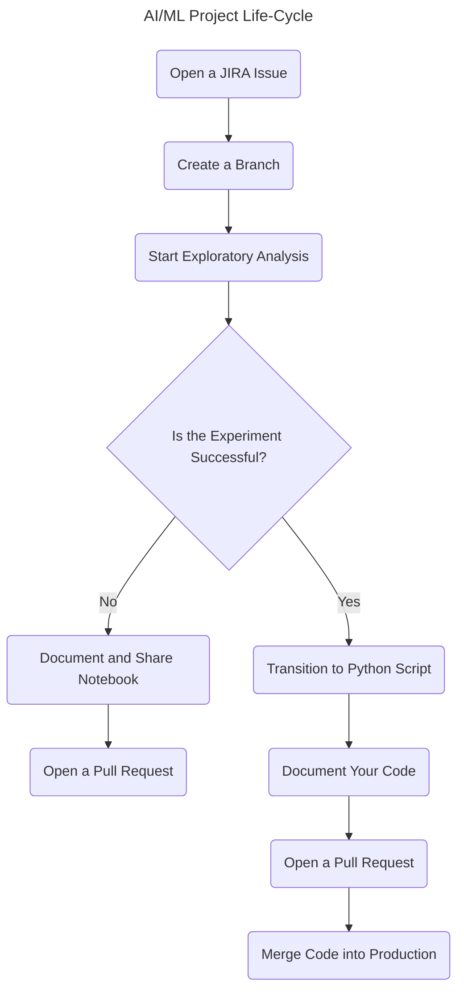

# Comprehensive Guide to AI/ML Project Life-Cycle Using Git and GitHub

## Overview

Effective use of Git and GitHub is essential for collaboration and
maintaining a robust codebase in AI/ML projects. This guide outlines
best practices for managing the life-cycle of your project using Git and
GitHub, ensuring reproducibility, scalability, and seamless
collaboration.

## Steps in the Life-Cycle

### 1. Open a JIRA Issue

- Open a JIRA issue to track your work and get the issue number. If
  necessary, create sub-tasks and use their issue numbers for more
  granular tracking.

### 2. Create a Branch

- Create a branch following the naming standard described in the [Git
  Branch Naming
  Standards](https://markeyser.github.io/cookiecutter-two-lanes/how-to-guides/git-branch-naming-standards/).
  Including the JIRA number in the branch name aids in navigation across
  the repository.

### 3. Start Exploratory Analysis

- Begin your exploratory analysis using a Jupyter notebook. This allows
  for quick prototyping and visualization. Before sharing your notebook,
  use the Black formatter and the Ruff linter to ensure code quality.
  Black ensures consistent code formatting, and Ruff helps with sorting
  imports, including docstrings, and other linting tasks.

### 4. Evaluate Exploration Outcomes

- **Unsuccessful Experiment:** If your exploration/experiment does not
  yield a viable solution, document the process and findings in the
  notebook. Share the notebook, keep the branch open but unmerged, and
  open a Pull Request (PR) for review. Close the JIRA issue.
- **Successful Experiment:** If your experiment is successful and needs
  to be tested in production, proceed with the next steps to transition
  from exploratory code to production-ready code.

### 5. Transition to Python Script

- Move your successful exploratory code from notebooks to Python scripts
  (.py). Design your classes, methods, and modules carefully. Ensure
  proper documentation, formatting, linting, testing, commenting,
  refactoring, and error handling to prepare the code for production.

### 6. Document Your Code

- If the code is moving to production, document your class and methods
  using MkDocs. Refer to [Build Your Python Project Documentation With
  MkDocs](https://realpython.com/python-project-documentation-with-mkdocs/)
  for guidance. Incorporate the generated documentation into the `docs`
  folder.

### 7. Open a Pull Request

- Open a Pull Request, undergo peer review, merge the branch into the
  production branch, close the JIRA issue, and delete the branch.

## Life-Cycle Flow Chart

