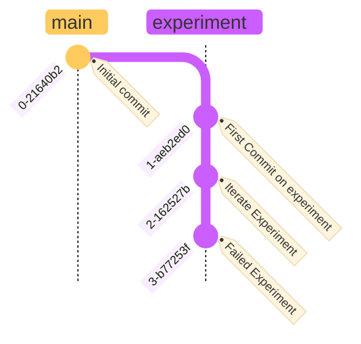

# ML Experiments Life-Cycle with Weights & Biases

Manage the life-cycle of your AI experiments effectively using Weights &
Biases by following this structured guide. Ensure reproducibility,
scalability, and collaboration through each phase of your experiment.

!!! note "Getting Started"
    Before you begin documenting your experiment, familiarize yourself with the goals and hypotheses of your experiment. This will enable you to create clear and effective documentation.

**ML Experiment Lyfe-Cycle with W&B**


## How to Create a GitHub Issue or a Jira Story for Your Experiment

Documenting your experiment's intent by opening a GitHub issue or Jira
story is the first crucial step in the experiment life-cycle.

!!! warning "Create an Issue/Story for Each Family of Experiments"

    This ensures consistency and traceability within your 
    project.

!!! info "Use a Template"
    Select the following a pre-defined template that fits experiment
    documentation: {Experiment Issue/Story Template](templates.md)

### Preparation

1. **Understand the Experiment**:
   Before you start documenting, ensure you have a clear understanding
   of the experiment's goals and the methods you'll use.

### Documentation Steps

2. **Create a New Issue/Story**: Navigate to your project's GitHub
   repository or Jira board and initiate a new issue or story.

3. **Use a Template**: If available use a pre-defined template that
   fits experiment documentation.

4. **Title Your Issue/Story**: Start with a succinct and descriptive
   title, prefixed with 'experiment/' followed by a brief identifier and
   issue number or Jira key.

5. **Describe Your Experiment**: Provide a detailed description of the
   experiment's background, objectives, and hypothesis.

6. **List Your Goals**: Clearly outline the specific goals or questions
   your experiment aims to address.

7. **Link to Resources**: Include links to any relevant documents, code
   repositories, or previous experiments.

8. **Ensure Visibility**: Make sure all potential stakeholders have
   visibility and encourage team members to comment.

9. **Submit the Documentation**: Once all details are filled in, submit
   your issue or story.


To reformat the guide for branch naming and management using the MkDocs Material theme, you would utilize a variety of the theme's features to enhance the presentation and usability of the document. Here's how you could write the markdown with Material for MkDocs features:

## How to Create a New Experiment Branch

This guide will provide a structured approach to creating a consistent
branch naming convention for your experiment.

!!! warning "Create a New Branch for Each Family of Experiments."
    This ensures consistency and traceability within your project.

### Create a Naming Convention

Structure your branch names to include the category, description, and
issue or Jira key.

```plaintext
experiment/<description>-<issue_number_or_jira_key>
```

For example:

```plaintext
experiment/rag-fusion-GH15
```

!!! note "Naming Convention"
    Choose names that are short yet descriptive to convey the branch's
    purpose at a glance and provide context for the work being 
    done.

!!! info "Best Practices for Experiment Branch Naming Conventions"
    For detailed insights and guidelines on establishing effective naming conventions for your experiment branches, please refer to the following resource: [Experiment Branch Naming Convention](github-actions-naming-convention.md).


## How to Develop Python Code for ML Experiments

Developing Python code for machine learning (ML) experiments is a
critical phase where your experimental concepts are transformed into
executable models and analyses. This how-to guide outlines a structured
approach to code development, focusing on integrating advanced ML
components like LangChain RAG Fusion into your projects.

### Preparing for Development

Before diving into coding, it's essential to align your development work
with the experiment's goals and requirements.

#### Review Experiment Documentation

- **Objective**: Ensure your development efforts are guided by the
  experiment's defined goals and success criteria.
- **Action**: Revisit the experiment's description, goals, and success
  criteria detailed in the GitHub issue or Jira story.

#### Conduct Technical Research

- **Objective**: Gain a deep understanding of the technologies and
  components you plan to integrate, such as LangChain RAG Fusion.
- **Action**: Review technical documentation, research papers, and
  source code related to the technologies in use.

### Implementing Your Experiment

Follow these steps to implement your experiment within your Python
codebase.

#### Data Preparation

- **Objective**: Prepare your data to meet the input requirements of
  your ML components.
- **Action**:
  1. Write scripts for data preprocessing.
  2. Ensure data formats are compatible with LangChain RAG Fusion.

#### Model Integration

- **Objective**: Seamlessly integrate the LangChain RAG Fusion component
  into your ML pipeline.
- **Action**:
  1. Adapt existing code to accommodate the new component.
  2. Define new interfaces or integrate third-party libraries as
     necessary.

#### Configuration and Parameters

At this stage, identify your experiment's hyperparameters and hardcode
them into your Python code. This decision is crucial for the
experiment's setup.

!!! warning "Identify Hyperparameters"
    Determine your experiment's hyperparameters now. We'll introduce
    dynamic parameter configuration with Weights & Biases (W&B) in the
    next section.

#### Logging and Monitoring

Understanding what metrics and outputs to log is essential. The detailed
setup for logging and monitoring will be covered next, using W&B.

!!! warning "Logging Setup Ahead"
    Prepare for logging by identifying key metrics. Dynamic logging
    and monitoring with W&B will be detailed in the following section.

### Ensuring Code Quality and Reliability

Maintain high standards of code quality and reliability throughout the
development process.

#### Write Unit Tests

- **Objective**: Verify that individual components of your code operate
  correctly.
- **Action**:
  1. Create unit tests for critical functions and modules.
  2. Use a testing framework like pytest to automate testing.

#### Conduct Integration Testing

- **Objective**: Ensure that different components of your system work
  together as intended.
- **Action**:
  1. Design and run integration tests after integrating new components.
  2. Pay special attention to the interaction between LangChain RAG
     Fusion and other parts of your system.

#### Perform Experiment Runs

- **Objective**: Validate the overall setup and functionality of your
  experiment.
- **Action**:
  1. Conduct initial small-scale runs to test the experimental setup.
  2. Adjust code and configurations based on initial outcomes.

!!! tip "Continuous Improvement"
    Treat the development process as iterative. Use insights from
    testing and initial experiment runs to continuously refine and
    improve your code.

By following this guide, you'll develop Python code for your ML
experiments that is not only aligned with your scientific goals but also
adheres to best practices in software engineering and ML research.

## How to Configure and Track ML Experiments with Weights & Biases

Configuring your machine learning experiments with Weights & Biases
(W&B) is crucial for effective tracking, logging, and optimization.
Follow this guide to set up W&B for managing and automating your
experiments.

### Setting Up W&B for Your Experiments

#### Create a Sweep Configuration

1. **Objective**: Define the experiment's hyperparameters and their
   search space.
2. **Action**: Write a `sweep_config.yaml` file detailing parameters and
   search strategies (grid, random, Bayesian).
3. **Version Control**: Ensure this file and other configuration files
   are under version control for reproducibility.

#### Adapt Your Code for W&B Integration

Integrating W&B into your Python code allows dynamic parameter
adjustment and comprehensive metric logging.

1. **Dynamic Parameters**:
   - Modify code to fetch and use parameters from W&B dynamically.
   - Utilize the W&B API to implement this functionality.

2. **Logging Metrics**:
   - Enhance your code to log training and evaluation metrics to W&B.
   - Ensure both outcome metrics and intermediate metrics are logged for
     in-depth analysis.

3. **Automate Hyperparameter Search with Sweeps**:
   - Set up W&B Sweeps in your code for automated hyperparameter
     optimization.
   - Handle sweep initialization, metric reporting, and parameter
     updates within your code.

!!! warning "Double-Check Experiment Reproducibility"
    Ensure you're logging **all** necessary components to guarantee
    experiment reproducibility. This includes:
    
    - **All Metrics**: Verify that every relevant metric is being captured.
    - **Modified Python Scripts**: Keep track of any changes in your Python scripts.
    - **Configuration Files**: Ensure all configuration files are logged and version-controlled.
    - **Notes and Labels**: Add descriptive notes and labels to your logged data for clarity.
    
    Reproducibility is key to validating and sharing your ML experiments. Missing data can lead to incomplete insights and challenges in replicating results. Always review your logging setup to ensure comprehensive coverage of your experiment's artifacts.

!!! tip "Best Practice: Use W&B's API Documentation"
    Refer to W&B's API documentation for detailed instructions on
    implementing these features in your code.

### Experiment Tracking Best Practices

Maximize the benefits of W&B for your ML experiments with these tracking
best practices.

1. **Comprehensive Logging**:
   - Log every relevant piece of experiment data, including
     configurations, results, and binaries.

2. **Iterative Improvement**:
   - Use logged data to iteratively refine your experiments, aiming for
     continuous improvement.

3. **Collaboration**:
   - Share experiment results on W&B's platform for collaborative
     analysis and discussion.

!!! tip "Collaboration is Key"
    Encourage team engagement by sharing insights and discussing
    experiment results through W&B.

Integrating W&B into your ML experiment workflow enhances tracking,
optimization, and collaboration. By following this guide, you'll
establish a solid foundation for managing your experiments, leading to
more efficient and impactful research outcomes.

To reformat the section on committing code changes before running experiments using the MkDocs Material theme, you would use Markdown enhanced with Material theme's features such as admonitions, code blocks, and tips. Here's how the reformatted section could look:

## Committing Code Changes Before Running ML Experiments

Ensuring that your code changes are committed before running machine
learning experiments is critical for maintaining reproducibility and
facilitating collaboration.

!!! warning "Reproducibility & Collaboration"
    Committing changes before experiments tie W&B runs to a specific
    code version, crucial for tracing experiment conditions and results.

### Importance of Pre-Experiment Commits

- **Reproducibility**: Committing changes before running experiments
  allows you to associate each W&B experiment run with the exact version
  of the code used. This is crucial for reproducibility, as it enables
  you and others to revisit and understand the conditions under which an
  experiment was conducted.
- **Tracking and Collaboration**: By committing before experiments, you
  ensure that the git SHA (a unique identifier for each commit) is
  captured by W&B. This allows team members to easily track which code
  changes correspond to which experiment results, facilitating
  collaboration and review.

### Steps for Committing Code Changes

1. **Review Your Changes**: Before committing, review your changes to
   ensure that they are complete and aligned with the experiment's
   objectives. This includes new code, modifications, configuration
   files, and any documentation updates.
2. **Stage Your Changes**: Use `git add` to stage the files you intend
   to commit. This step allows you to select exactly which changes you
   want to include in your commit.
3. **Commit with a Meaningful Message**: Commit your staged changes
   using `git commit`, providing a descriptive message that clearly
   summarizes the changes made and their purpose. This message is
   invaluable for historical context and understanding the evolution of
   your project.
4. **Push to Remote Repository**: Push your commit to the remote
   repository to ensure it is shared with your team and integrated into
   the project's shared history. This step is critical for remote
   collaboration and backup.

Committing code changes before running experiments is a critical
practice that underpins the reliability and integrity of your machine
learning projects. It ensures that every experiment conducted with W&B
is traceable to a specific code state, thereby enhancing
reproducibility, facilitating collaboration, and supporting rigorous
scientific inquiry. By embedding this practice into your workflow, you
establish a robust foundation for conducting and sharing machine
learning experiments.

## How to Run Experiments and Manage Outcomes with Weights & Biases

Running experiments with Weights & Biases (W&B) and managing the outcomes efficiently is crucial for the success of machine learning projects. This guide provides a structured approach to executing experiments and handling the results, whether integrating successful outcomes into production or documenting learnings from unsuccessful attempts.

### Initiating Experiments with W&B

#### Start Your W&B Runs

1. **Objective**: Log parameters, metrics, and outcomes of your experiment.
2. **Action**: Ensure your code initializes a W&B run at the start of your experiment script.

#### Automate with W&B Sweeps

1. **Objective**: Optimize hyperparameters and manage multiple configurations efficiently.
2. **Action**: Set up W&B Sweeps in your `sweep_config.yaml` and initiate them for automated parameter exploration.

#### Monitor and Analyze Results

1. **Objective**: Keep track of experiment progress and analyze data for insights.
2. **Action**: Use the W&B dashboard for real-time monitoring and result analysis.

### Experiment Branch Strategy

#### For Successful Experiments


1. **Opening Pull Requests**: Prepare and open a PR for successful experiment branches, clearly documenting the experiment and its findings.
2. **Peer Review**: Undergo a review process, providing links to W&B pages for detailed metrics.
3. **Documentation**: Record the experiment's methodology and findings in the project's main documentation.

#### For Unsuccessful Experiments



1. **Keep Branches Open**: Retain the experimental branch open for documentation and to avoid repeating unsuccessful experiments.
2. **Analysis and Documentation**: Document the approach, results, and learnings from the experiment in the repository.

!!! info "Comprehensive Guide to Branch Strategy"
    For an in-depth exploration of best practices and strategies for managing branches within your projects, consult our dedicated guide: [Branch Strategy](branching-strategy.md).

### Best Practices

- **Batch Running and Automation**: Use scripts or CI/CD pipelines for automating experiments, especially when leveraging W&B Sweeps.
- **Iterative Improvement**: Apply insights from all experiments to refine future experimental designs.
- **Collaboration and Sharing**: Promote a collaborative environment by sharing results and insights within the team and using W&B for discussions.